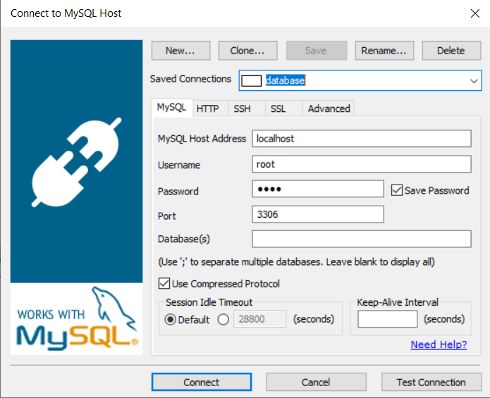

### About Project
This is the final project for Unlock program.
### Set up your project
1. Install docker: </br>
  Follow steps in the [link](https://docs.docker.com/desktop/windows/install/)
2. Clone this project using git:
    ```
    $ git clone git@github.com:tanthanhpham/project_nfq.git
    ```
3. Build docker:
    ```
    $ cd project_nfq\
    $ docker-compose up -d
    ```
4. Install library:
    ```
    $ docker exec -it php bash 
    $ composer install
    ```
5. Create tables
    ```
    $ php bin/console doctrine:migrations:migrate
    ```
6. Download SQLyog [here](https://github.com/webyog/sqlyog-community/wiki/Downloads)
7. Connect database
   ```
   username: root
   password: root
   ```
   
8. Insert data 
   ```sql
   USE project_nfq;

   INSERT INTO category(name, parent_id, image) VALUES ('All categories', NULL, '/parent_image.png');
   INSERT INTO category(name, parent_id, image) VALUES ('Pan', '1', '/pan_image.png');
   INSERT INTO category(name, parent_id, image) VALUES ('Shirt', '1', '/shirt_image.png');
   INSERT INTO category(name, parent_id, image) VALUES ('Jacket', '1', '/jacket_image.png');
   
   INSERT INTO product(category_id, name, price, image, descriotion, material) VALUES (2, 'Product name', 300000, '/product_image.png', 'Product description', 'Product material');
   INSERT INTO product(category_id, name, price, image, descriotion, material) VALUES (3, 'Product name 1', 400000, '/product_image_1.png', 'Product description 1', 'Product material 1');
   INSERT INTO product(category_id, name, price, image, descriotion, material) VALUES (2, 'Product name 2', 500000, '/product_image_2.png', 'Product description 2', 'Product material 2');
   INSERT INTO product(category_id, name, price, image, descriotion, material) VALUES (4, 'Product name 3', 340000, '/product_image_3.png', 'Product description 3', 'Product material 3');
   
   ```
### API
1. Get all products
    ```url
    GET 127.0.0.1/api/products
    ```
2. Filter product by category
   ```url
    POST 127.0.0.1/api/products/search
   ```
   ```json
   {
      "category": 2
   }
   ```